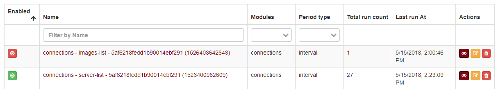
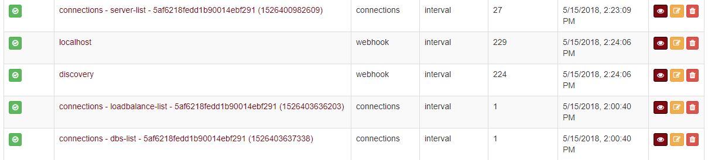
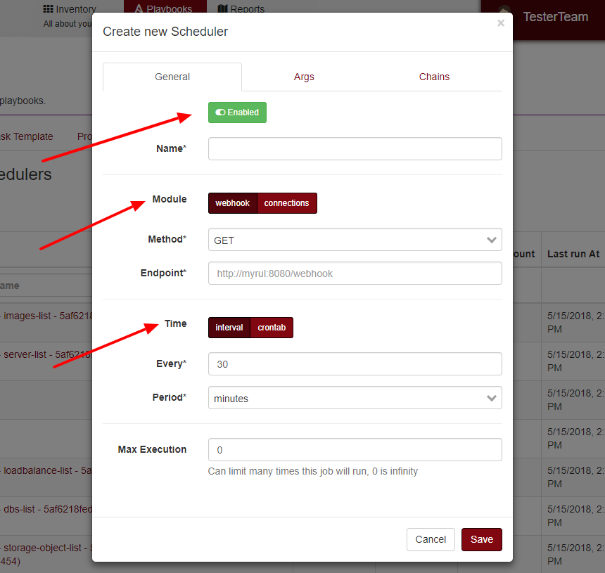

Scheduler
=========

The scheduler is a time-based job scheduler, and it is responsible for managing and executing job cross Maestro, it used to synchronize the cloud providers data, to update reports and can be used by users.

------------

To list all schedules, go to reports -> scheduler.

------------

As an example, we can see schedulers responsable to automatic sync a cloud provider data on Maestro.

------------

Creating a custom job.
----------------------

You can create a custom job.

       