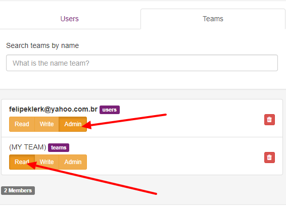
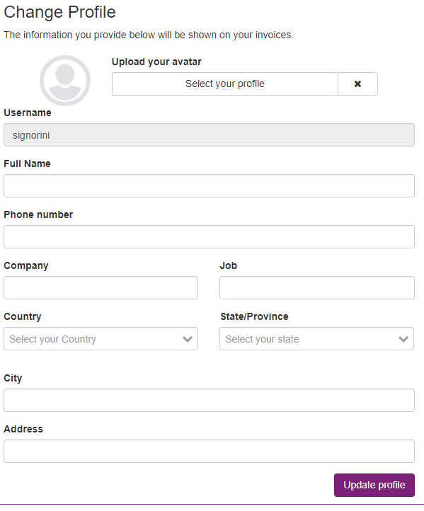
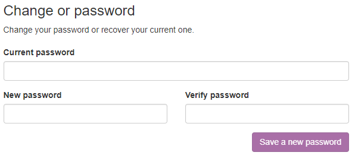
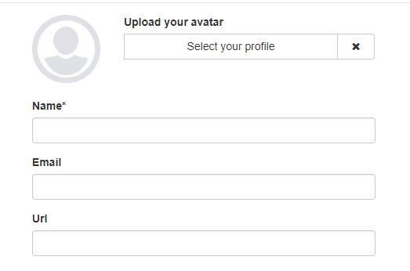

Access rules
====================

The Maestro ACL is composed of multiple entity type and each entity has a one rule.

**Entities can be:**

- a user
- a team

**Rules can be:**

+--------+------------------------------------------+
| Read:  | Read access                              |
+--------+------------------------------------------+
| Write: | Can read and update                      |
+--------+------------------------------------------+
| Admin: | Can create and delete                    |
+--------+------------------------------------------+

- The authentication control system is set at the resource level, that means each record has your own acl rule.

- You can create teams to share the same access to multiple users, and under the hood the user assume the team identity and then the team can access that record.

The ACL modal can be found on any resources suah as servers, applications, graphs, reports and more.

------------

Users
-----

You can update your profile.

------------

------------

Change password
---------------

If you like to change the access password, you can go to profile > change password

------------

------------

Teams
=====

To create a team, go to the main menu on the right corner, and click on the Teams page.

Each team has a name, email, avatar and members.

------------

